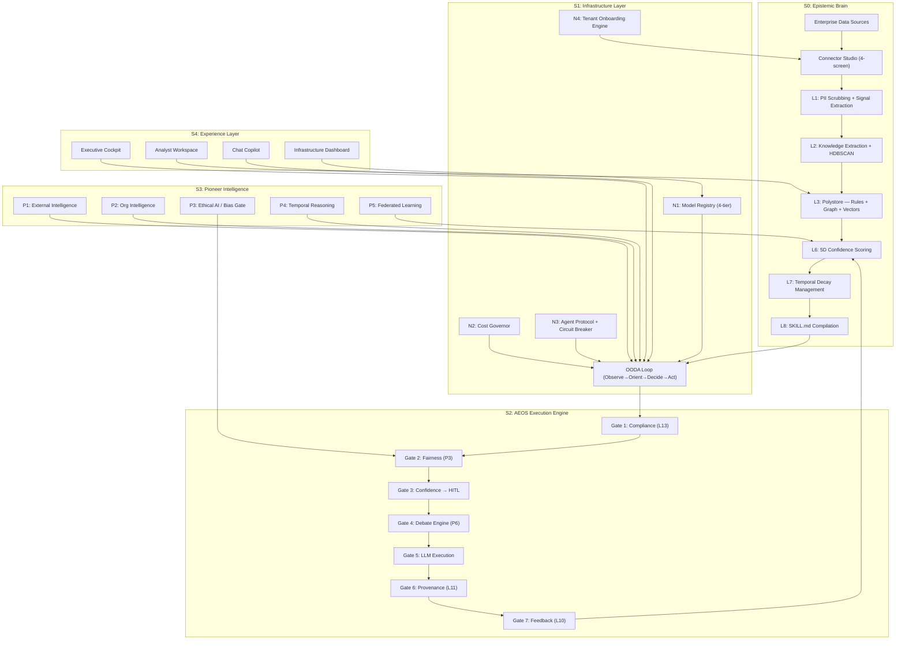

<p align="center">
  
  
</p>

<h1 align="center">KAEOS — Knowledge-Augmented Enterprise Operating System</h1>
<p align="center">
  <strong>5-Stratum Epistemic-Agentic Platform — Knowtique × AEOS × Pioneer Intelligence</strong>
</p>

<p align="center">
  <a href="#-quick-start">Quick Start</a> •
  <a href="#-what-is-aeos">What is AEOS?</a> •
  <a href="#-architecture">Architecture</a> •
  <a href="#-features">Features</a> •
  <a href="#-tech-stack">Tech Stack</a> •
  <a href="#-contributing">Contributing</a> •
  <a href="#-license">License</a>
</p>

<p align="center">
  
  
  
  
</p>

---

KAEOS is an open-source **enterprise-grade epistemic operating system** built on a **5-stratum architecture** — engineered not to *store* what an organisation knows, but to **operationalise how it actually thinks, decides, and evolves**.

### The 5-Stratum Architecture

| Stratum | Layer | What It Does |
|---------|-------|-------------|
| **S0** | 🧠 Epistemic Brain (Knowtique) | Extracts rules, scores with 5D confidence, detects contradictions, compiles SKILL.md contracts |
| **S1** | 🔧 Infrastructure | 4-tier model routing, inference cost governor, inter-agent protocol, tenant onboarding engine |
| **S2** | ⚡ AEOS Execution Engine | OODA cognitive loop, 7-gate trust pipeline, debate engine, governance gates |
| **S3** | 🌐 Pioneer Intelligence | External intel, org intelligence, ethical AI/bias, temporal reasoning, federated learning |
| **S4** | 🖥️ Experience Layer | Executive cockpit, analyst workspace, connector studio, conversational copilot |

These strata form a **continuous intelligence loop**: Execution outcomes feed back into the Epistemic Brain, confidence recalibrates, skills evolve, and agents get smarter with every decision.

---

## 🕐 Why Now

1. **MCP protocol shipped (2025)** — Knowtique is MCP-native. Most competitors aren't. Agent-to-tool interop is finally standardized.
2. **EU AI Act enforcement begins (2026)** — The fairness engine and compliance gates aren't optional features anymore; they're legally required for autonomous decisions.
3. **Enterprise AI agent adoption is exploding, but trust infrastructure doesn't exist** — Every enterprise wants agents. None of them can audit what those agents decided, or why. That's the gap Knowtique fills.

---

## 🤖 What is AEOS?

**AEOS (Agentic Epistemic Operating System)** is the intelligent agent runtime that sits at the heart of Knowtique. While Knowtique handles knowledge extraction and management, AEOS is the execution layer that turns that knowledge into autonomous action.

### The AEOS 7-Gate Execution Pipeline

Every agent action passes through a mandatory 7-gate trust pipeline before execution:

```
┌─────────────────────────────────────────────────────────────────────┐
│                    AEOS Agent Execution Pipeline                     │
├─────────┬───────────┬────────────┬────────┬─────────┬───────┬───────┤
│ Gate 1  │  Gate 2   │   Gate 3   │ Gate 4 │ Gate 5  │Gate 6 │Gate 7 │
│Compliance│ Fairness  │ Confidence │ Debate │ Execute │Prove- │Feed-  │
│Pre-Check│Assessment │  → HITL    │ Engine │  + LLM  │nance  │back   │
│ (L13)   │   (P3)    │   Gate     │  (P6)  │         │ (L11) │ (L10) │
│         │           │            │        │         │       │       │
│Blocks   │Demographic│If < 0.82 → │3-agent │Skill    │SHA-256│Bayesian│
│SOX/GDPR │impact     │human       │adversa-│steps    │hash   │update │
│/PCI     │scoring    │review      │rial    │evaluated│chain  │+ learn│
│violations│          │queue       │debate  │via LLM  │audit  │       │
└─────────┴───────────┴────────────┴────────┴─────────┴───────┴───────┘
```

### AEOS Built-in Capabilities

| Module | What It Does |
|--------|-------------|
| **External Intelligence** | Ingests external signals (regulatory changes, vendor API deprecations, market shifts) and correlates with internal KB to generate proactive alerts |
| **Org Intelligence** | Maps influence networks, change readiness scores, and skills topology across business units |
| **Fairness Engine** | Fairness scoring (0.0–1.0) across 5 protected attributes. Pre-execution ethics gate blocks biased actions |
| **Temporal Reasoning** | Native time-aware decisions — fiscal calendars, payroll cycles, compliance deadlines |
| **Federated Learning** | Zero-knowledge skill sharing across tenants. Privacy-preserving model aggregation |
| **Debate Engine** | Proposer/Devil's Advocate/Arbitrator adversarial reasoning for high-stakes actions |

### AEOS Agent Factory

Build agents with natural language — the AEOS Agent Factory pipeline:

```
Prompt → Blueprint → Refine → Approve → Compile → Deploy → Monitor
```

1. **Describe** what you need in plain English
2. **AEOS generates** a structured agent blueprint (domain, capabilities, risk level, data sources)
3. **Review & refine** the blueprint interactively
4. **Compile** into a deployable agent with SKILL.md contracts
5. **Deploy** with full trust pipeline enforcement
6. **Monitor** execution in real-time via the Command Center

---

## ✨ Features

### Five Operating Modes

| Mode | What It Does |
|------|-------------|
| **🌾 HARVEST** | Passively mines enterprise systems using ML to reverse-engineer implicit business rules — zero employee effort |
| **🎯 ELICITATION** | Deploys behavioural-science-informed micro-surveys targeting real recent events to capture tacit knowledge |
| **⚡ EXECUTION** | Serves structured, versioned SKILL.md files to AI agents via MCP with AEOS trust pipeline enforcement |
| **🔍 REFLECTION** | Autonomous KB sweep — contradiction scanning, coverage gap analysis, staleness detection |
| **🧬 EVOLUTION** | Rewrites rules based on production agent execution data. Promotes, demotes, archives — compounding intelligence flywheel |

### Knowledge Engine

- **Data Fabric** — ETL pipeline with DAG-based transforms, PII scrubbing, chunking
- **Knowledge Extraction** — HDBSCAN clustering + LLM-powered rule mining and contradiction detection
- **Polystore** — PostgreSQL rules + Neo4j graph + pgvector embeddings
- **5D Confidence Scoring** — Weighted harmonic mean across source breadth, authority, temporal freshness, outcome validation, explicit validation
- **Temporal Decay** — Half-life model `C(t) = C₀ × 0.5^(t/T½)` with scheduled hourly decay loops
- **SKILL.md Compilation** — Versioned agent contracts with progressive disclosure (3 levels)
- **Closed-Loop Feedback** — Agent outcomes feed back into KB. Success reinforces, failure triggers elicitation

### Trust & Governance

- **Provenance Ledger** — SHA-256 hash chain audit trail for every KB write and agent action
- **Red Team Harness** — Boundary testing, prompt injection defence, confidence calibration
- **Compliance Engine** — GDPR, SOX, HIPAA, PCI-DSS pre-execution blocking
- **Conflict Resolution** — Split-screen workspace for resolving contradictions between rules
- **Skills Marketplace** — Community-rated skill templates with fork-and-customise workflow

### Advanced Capabilities

- **Predictive Ops** — Analyzes signals for latent intent, suggests proactive actions
- **Polymorphic Engine** — Self-writing MCP tools, LLM-generated integration code
- **Federated Intelligence** — Zero-knowledge skill sharing across tenants
- **Ambient Monitoring** — Continuous macro-signal monitoring with auto-regulatory rule synthesis

---

## 🏗 Architecture (KAEOS 5-Stratum)



---

## 🚀 Quick Start

### Prerequisites

- **Python 3.11+**
- **Node.js 20+**
- **Git**

### Option 1: Docker (Recommended)

```bash
git clone https://github.com/Daksh-Aneja/Knowtique.git
cd Knowtique
cp .env.example .env
# Edit .env with your LLM API keys (optional — platform works without them)
docker compose up --build
```

- **Frontend**: http://localhost:5174
- **Backend API**: http://localhost:8001
- **API Docs**: http://localhost:8001/docs

### Option 2: Manual Setup

```bash
# Clone
git clone https://github.com/Daksh-Aneja/Knowtique.git
cd Knowtique
cp .env.example .env

# Backend
cd backend
python -m venv venv
source venv/bin/activate  # Windows: venv\Scripts\activate
pip install -r requirements.txt
uvicorn app.main:app --host 0.0.0.0 --port 8001 --reload

# Frontend (new terminal)
cd frontend
npm install
npm run dev
```

The backend auto-seeds with demo data (6 skills, 24 rules, 18 connectors, sample executions) on first launch.

---

## 🛠 Tech Stack

| Layer | Technology |
|-------|-----------|
| **Backend** | FastAPI 0.115 · SQLAlchemy 2.0 · Pydantic 2.9 |
| **Database** | SQLite (dev) · PostgreSQL (prod) |
| **Frontend** | React 19 · Vite 8 · TypeScript 6 · TailwindCSS 4 |
| **LLM** | LiteLLM (BYOK) — Anthropic, OpenAI, Groq, Mistral, Ollama |
| **AEOS Runtime** | 7-gate trust pipeline · Debate engine · Fairness gate |
| **Design** | Linear-inspired dark/light system · Inter + JetBrains Mono |
| **Charts** | Recharts · Framer Motion |

## 📊 Platform Scale

| Metric | Count |
|--------|-------|
| Backend API Routes | **137+** |
| Backend Services | **33 modules** |
| Domain Models | **33 SQLAlchemy models** (11 new S1 infrastructure) |
| Frontend Views | 5 consolidated + **30 detailed pages** |
| Architecture Strata | **5 (S0–S4)** |
| AEOS Trust Gates | 7 per execution |
| API Client Methods | **85+ typed fetch functions** |
| KAEOS Infrastructure | N1 Model Registry, N2 Cost Governor, N3 Agent Protocol, N4 Onboarding |

---

## 🤝 Contributing

We welcome contributions! Please see [CONTRIBUTING.md](CONTRIBUTING.md) for guidelines.

- **Bug Reports**: Open an issue with reproduction steps
- **Feature Requests**: Open an issue with use case description
- **Pull Requests**: Fork → branch → commit → PR

## 📄 License

This project is licensed under the **Apache License 2.0** — see the [LICENSE](LICENSE) file for details.

## 🔒 Security

If you discover a security vulnerability, please see [SECURITY.md](SECURITY.md) for our responsible disclosure policy. **Do not open public issues for security vulnerabilities.**

---

<p align="center">
  <strong>KAEOS</strong> — Knowledge that thinks. Agents that reason. Systems that evolve.
  <br/>
  Built with ❤️ for the open-source AI community
</p>
